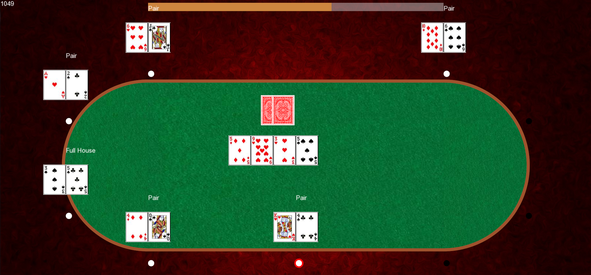

# 2D Poker Game

After doing 3D graphics for a while, I took a small break and started focusing my efforts on understanding an efficient architecture for a graphics engine (which is arguably the most important part). Thus came a basic architecture that I continue to use for smooth animations, as well as the general framework for maximizing speed.

## Images

