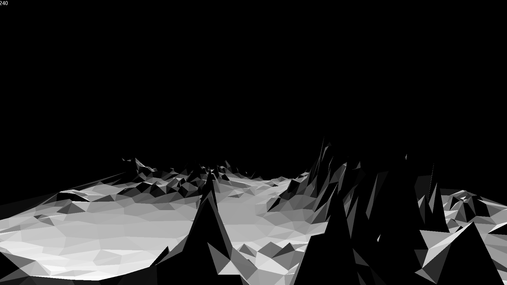

# First Foray in 3D Graphics in C++

This project was the first time I created something worth looking at in C++. The graphics are rendered using a 2D framework called SFML. All the calculations and matrix transformations are written myself from scratch. This includes the entire rendering pipeline, and algorithms and sorting required to determine the order at which to render each triangle.

## Images

