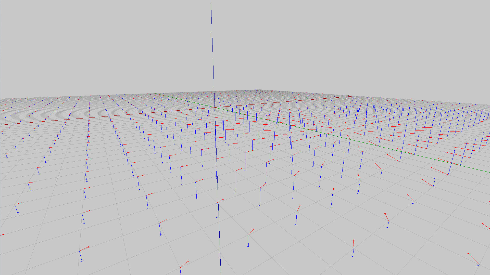

# 3D Graphing

I had too much fun doing the 2D graphing that I extended it in the 3D realm with my then second iteration of my 3D rendering engine called Ansel. It allows you to make a 2D or 3D equation and graph it in a 3D environment. It allows you to make 3D shapes that are dened by equations.

## Images

Plotting two separate plots that utilize a 3D equation for each axis.